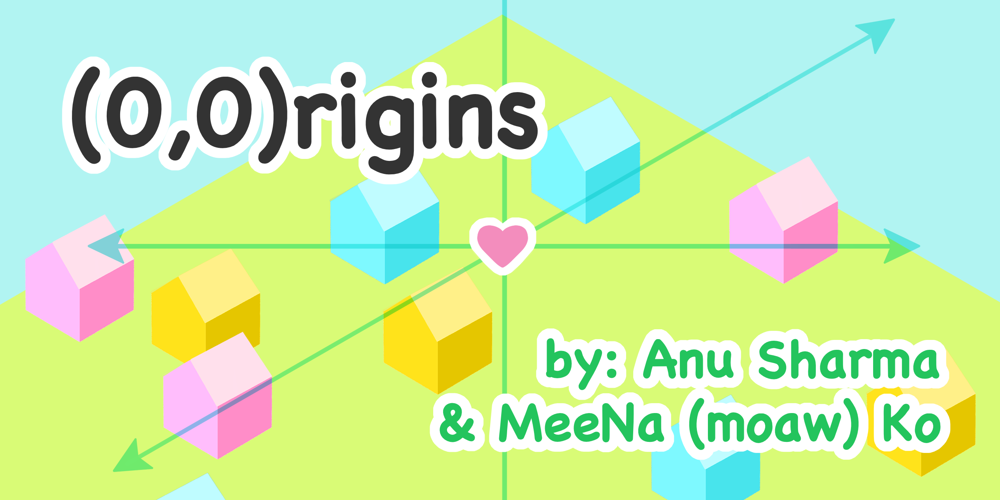
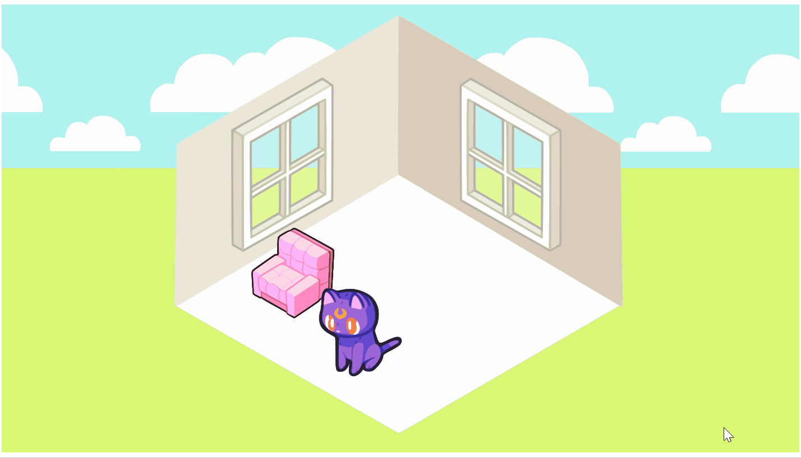

## About

((0,0)rigins) is a love letter to virtual worlds on Web 2.0 and community-driven play: A virtual room decor game that’s also an archive of curated virtual artifacts. Users are encouraged to decorate their own spaces with various furniture pieces, which include 2D recreations of personal objects submitted by Asian American individuals. These submissions are documented in the game’s catalog, along with their original owner’s name and a short description of their origin. Each artifact functions as a metadata tag and creates a network of every room that hosts a copy of the artifact. The various hashtags used in room descriptions and artifacts connect users’ narratives to each other.

((0,0)rigins) allows the Asian American community to lovingly express themselves and their most cherished items, archive their narratives, and spontaneously discover other users. Operating outside of conventional social media models, users of ((0,0)rigins) can manipulate and express themselves freely within their own virtual rooms. This game reimagines hashtags as a user-driven tool for generative creation.

## Gameplay



On the web interface, users will be able to enter their room and access furniture and decor items via search/filter by artifact tags. Each piece – each one a contribution from individual players – can be selected, dropped into their room and dragged and repositioned within the room. Artifacts can be rotated, flipped and may come with an assortment of colors to choose from. Artifacts will contain metadata about the piece, written and submitted by the original contributors, that the user can flip through. Users can also request their own item with special metadata of their own (that will be shared with others), via simple submission form on the webpage. 

## Credits 
- MeeNa (moaw) Ko • Co-Creator | Art Lead • [Website](https://moaw.art)
- Anu Sharma • Co-Creator | Developer • [LinkedIn](https://www.linkedin.com/in/anu-sharma-6936a686)

---

## Svelte App 

Everything you need to build a Svelte project, powered by [`create-svelte`](https://github.com/sveltejs/kit/tree/master/packages/create-svelte).

### Developing

Once you've created a project and installed dependencies with `npm install` (or `pnpm install` or `yarn`), start a development server:

```bash
npm run dev

# or start the server and open the app in a new browser tab
npm run dev -- --open
```

### Building

To create a production version of your app:

```bash
npm run build
```

You can preview the production build with `npm run preview`.

> To deploy your app, you may need to install an [adapter](https://kit.svelte.dev/docs/adapters) for your target environment.
